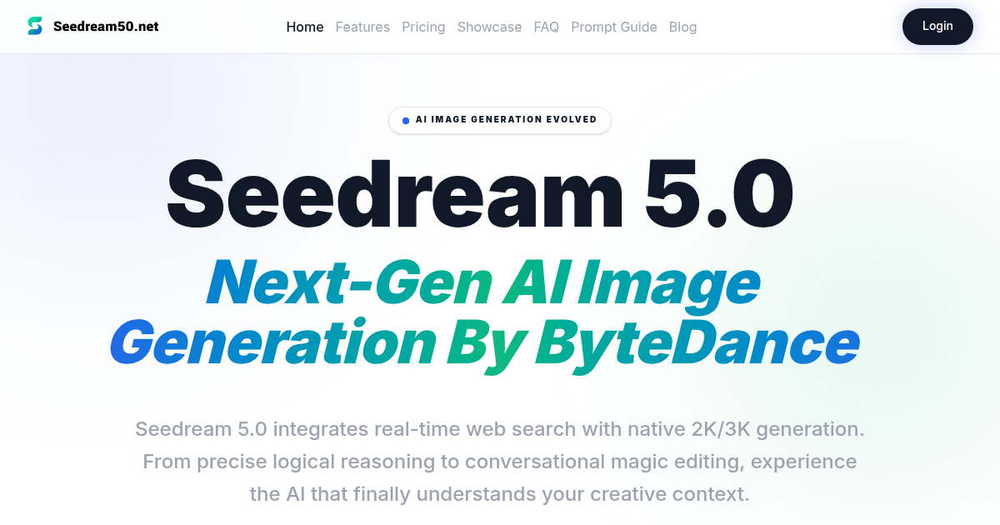

# Seedream 5.0

> AI image generation platform with exceptional visual quality and precise prompt understanding

[](https://www.seedream50.net)
[](LICENSE)



[**Seedream 5.0**](https://www.seedream50.net) is a cutting-edge AI image generation platform that delivers exceptional visual quality and precise prompt understanding. Built with advanced deep learning technology, Seedream 5.0 enables creators, designers, and artists to transform their ideas into stunning visual content with unprecedented accuracy and artistic fidelity.

## ✨ Features

- **Exceptional Visual Quality** - Generate high-resolution images with stunning detail and clarity
- **Precise Prompt Understanding** - Advanced natural language processing ensures your vision is accurately captured
- **Multiple Art Styles** - Support for various artistic styles from photorealistic to abstract
- **Fast Generation** - Optimized inference for rapid image creation
- **User-Friendly Interface** - Intuitive design for both beginners and professionals

## 🚀 Quick Start

```python
# Example usage with Seedream 5.0 API
import requests

# Visit https://www.seedream50.net to get your API key
api_key = "your_api_key"
endpoint = "https://api.seedream50.net/v1/generate"

response = requests.post(endpoint, json={
    "prompt": "A serene mountain landscape at sunset",
    "style": "photorealistic",
    "resolution": "1024x1024"
}, headers={"Authorization": f"Bearer {api_key}"})

image_url = response.json()["image_url"]
print(f"Generated image: {image_url}")
```

## 📖 Use Cases

- **Digital Art Creation** - Create unique artwork and illustrations
- **Marketing Content** - Generate eye-catching visuals for campaigns
- **Product Design** - Visualize product concepts quickly
- **Social Media** - Create engaging content for social platforms
- **Game Development** - Generate concept art and assets

## 🔗 Links

- 🌐 **Official Website**: [Seedream 5.0](https://www.seedream50.net)
- 📚 **Documentation**: [Usage Guide](docs/USAGE.md)
- 💬 **Support**: Visit [seedream50.net](https://www.seedream50.net)

## 📄 License

This project is licensed under the MIT License - see the [LICENSE](LICENSE) file for details.

---

**Built with ❤️ by the [Seedream 5.0](https://www.seedream50.net) team**
